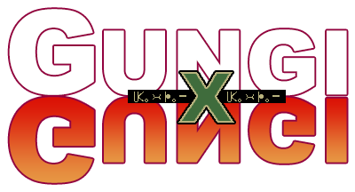
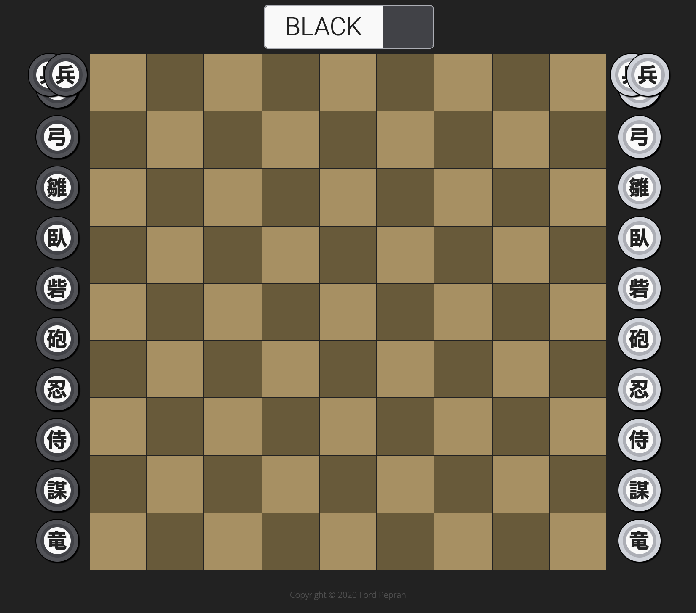

Gungi
=====

An Electron application implementing the Gungi board game making use of the C++
Gungi library: https://github.com/hkpeprah/gungi

Gungi is a board game from Hunter X Hunter, described as a mix between Go and
Shogi.  The goal of the game is to capture the opposing team's Commander.



## Requirements

- C++11
- [CMake](https://cmake.org/) version `3.4.1` or newer.
- [Make](https://www.gnu.org/software/make/) version `3.81` or newer.
- [NodeJS](https://nodejs.org/en/download/package-manager/)

## Building

### C++ Library

```
$ npm run build:lib
```

### Application

```
$ npm run build
```

### Deployable Mac Application

```
$ npm run build:mac
```

## Usage

```
$ npm start
```

## Rules

Please read the documentation outlining the game rules [here](./RULES.md).

## License

This project is licensed under the [MIT License](./LICENSE.md).
